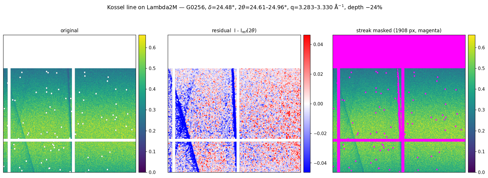

# Proposal: automatic artifact masking in pySimpleMask

**For:** Miaoqi Chu · **From:** Q. Zhang · **Date:** 2026-09-17

Diamond-anvil-cell patterns at 8-ID-E carry narrow dark lines crossing the
scattering, plus localised bright spots — neither detected automatically today.
Example frame:

```
/gdata/dm/8ID/8IDE/2026-3/pope202609/data/E0157_EHEA-Mesh_a0001_f000010_eiger4M_r00006/E0157_EHEA-Mesh_a0001_f000010_eiger4M_r00006.h5
```

Below: a way to find them, what a prototype did on real data, and a confirmed
example on Lambda2M to develop against.

---

## 1. What they are

**Kossel lines from the diamond anvil.** Diffuse scattering from the sample acts
as a divergent source illuminating the downstream anvil, a large single crystal.
Directions meeting a Bragg condition get diffracted out of the transmitted cone,
leaving a narrow dark line where intensity is *missing*.

Two properties matter for the software:

- **They are dark, not bright** — subtractive. Every line found in this study was
  dark.
- **They are fixed in the lab frame, by the cell orientation**, not in detector
  pixels. They move drastically when the cell is rotated and barely at all when
  the sample is translated (operator experience). The confirmed case in §3 backs
  this from the data: the same pixels show a −23% line at one detector angle and
  nothing 4° away.

The bright spots are the complementary case: an anvil or coarse-grain reflection
landing *on* the detector.

The practical consequence: an artifact mask is valid for one cell orientation,
and stays valid across a translation mesh.

---

## 2. Proposed algorithm

The assumption is that true I(q, φ) is smooth for a powder-like sample, so
anything abrupt is an artifact. Build the mask from a **high-statistics sum**, not
a single frame — the Eiger example averages 0.287 counts/pixel, and the lines are
visible only because the eye integrates along them. Artifacts are static within an
orientation, so summing a mesh is free and valid.

Apply the blemish layer before thresholding, eroded a few pixels so gap and border
neighbours go with it — pySimpleMask already loads one by default. The prototype
skipped this and immediately tripped: five of its six strongest "line" detections
were the detector's last column.

```
1. reference    I_ref(q) = median over φ within fine q bins
2. residual     R = I − I_ref(q)
3. integrate    R_s = smooth(R)              # lines are EXTENDED
4. threshold    σ = 1.4826 · MAD(R_s);  flag |R_s| > n·σ
5. classify     connected components → aspect ratio: high = line, low = spot
```

Use the **median**, not the mean, at step 1 — it does not chase the outliers being
hunted.

A note on using derivatives, which was the original suggestion: the instinct is
right, but at ~0.3 counts/pixel a literal finite difference is pure shot noise.
Steps 2–3 are the same idea implemented as a matched filter — difference from a
smooth reference at the feature's own scale — which is noise-optimal.

### Three things that break it

All three were hit while prototyping; they are the useful part of this proposal.

**(a) The reference must follow the true q contours.** A first attempt used
"median along detector rows". On Lambda2M that is nearly right, because the
virtual beam centre sits ~19,000 rows off-detector and rings are almost straight
horizontal lines. **On Eiger4M it fails completely** — the q gradient runs across
columns there, so a row-median averages straight across the signal and detects
nothing. Use the real q map.

So on Eiger, where the geometry is uncertain: the q map has to be *locally*
correct, not absolutely correct — a wrong beam centre distorts ring shape and
smears the reference. Where geometry is hopeless, see (c).

**(b) Dead pixels and physical artifacts look identical to a threshold.** They are
not the same thing and have different lifetimes:

```
depth / I_ref ≈ −100%        dead pixel      → permanent, belongs in blemish
depth / I_ref ≈ −10…−60%     Kossel line     → per orientation
```

This is the guard against a *stale* blemish map: dead pixels accumulate between
updates, and whatever is not yet flagged will be the detector's first find — which
is exactly what happened (§3).

**(c) Geometry-free fallback.** Where the q map cannot be trusted, a line is still
a line: detect narrow extended features directly in pixel space with a
Radon/Hough transform of the residual, or morphological opening with a line
structuring element at several orientations. Less sensitive, but needs no
geometry. Worth shipping alongside the q-φ path.

---

## 3. What the prototype found

Two passes. A sparse first pass over the 1398 Lambda2M datasets found only
detector defects. A second pass over the 28 long (3000-frame) Lambda2M
acquisitions, this time with the blemish map applied, produced the confirmed case
below. The Eiger example was handled separately.

### A confirmed Kossel line on Lambda2M — use this as the test case

The first pass found none, because it did not apply the blemish map and dead
pixels swamped everything. Re-run over the 28 long (3000-frame) Lambda2M
acquisitions with the blemish applied, requiring the feature to sit in the
detector interior:

```
dataset   G0256_HEA-Dec9GPa_a0001_f003000_lambda2M_r00001   (also G0253/54/55)
delta     24.48°
pixels    rows 650–899, columns 755–772   (1908 px, aspect 14)
angle     2θ = 24.606–24.963°   →   q = 3.2827–3.3295 Å⁻¹
depth     −24.1% of local I_ref
```



*Left: original. Middle: residual against I_ref(2θ) — the line is invisible in
the raw frame and unmistakable here. Right: the 1908 masked pixels in magenta.*

It passes the three discriminations that matter:

| test | result |
|---|---|
| dead pixel? | **No** — depth is −24%, not −100% |
| reproducible? | **Yes** — four independent 3000-frame runs at this orientation |
| detector defect? | **No** — see below |

The last is decisive. A detector defect is fixed in *pixel* coordinates and reads
the same at any detector angle; a Kossel line is fixed in the *lab* frame, so it
moves across the detector as delta changes. Probing the identical pixels, against
the row predicted for a fixed 2θ:

| dataset | delta | depth at those pixels | predicted row if lab-fixed |
|---|---|---|---|
| G0256 | 24.48° | **−24.1%** | 793 — where it is |
| G0246 | 24.91° | −9.9% | 1091 — moving off the template |
| G0207 | 20.28° | −0.8% **gone** | −2145 — off the detector |
| G0228 | 20.58° | −1.4% **gone** | −1935 — off the detector |

The feature tracks the prediction: strong where a fixed-2θ line should sit,
fading as the detector rotates away, absent once the predicted row leaves the
detector entirely. That is a Kossel line, not hardware.

One consequence worth noting: **q = 3.283–3.330 Å⁻¹ overlaps the sample peak at
3.288** used for the XPCS analysis of this same dataset. The line is 0.5% of the
pixels in that ROI at −24% depth, so it contributes roughly 3% of the measured
static floor — small, but it is exactly the kind of contamination the masking
removes.

### Check the reference model before trusting it

Whether the q map can be trusted is testable in a few lines: build two or three
candidate references and compare residual RMS. On the two detectors here it comes
out opposite ways.

| reference model | Lambda2M | Eiger4M |
|---|---|---|
| I(row) | 0.0280 | 0.42934 |
| I(2θ) from metadata geometry | **0.0278** | 0.42664 |
| I(col) | 0.0454 | **0.05179** |

On Lambda the metadata geometry wins — expected, since the virtual centre sits
~19,000 rows off-detector so rings are nearly horizontal — and that is why the
detection above can be believed. On Eiger the metadata 2θ map is **no better than
assuming rings run along rows**, while an empirical I(col) reference fits 8×
better: the geometry there is falsified by its own data (that detector is on a
manual stage). A first attempt at Eiger detection found nothing for exactly this
reason.

Recommend running this test and selecting the reference by residual RMS, rather
than assuming the metadata is right. Where no model fits, fall back to §2(c).

---

## 4. Suggested interface

Three mask layers with different lifetimes, kept separate:

| layer | lifetime | source |
|---|---|---|
| blemish | permanent, per detector | site TIFF (maintained by the beamline) |
| **artifact** | per cell orientation | proposed auto-detection |
| user | per analysis | manual ROI |

A minimal CLI surface consistent with the existing `build` options:

```
--auto-artifact {off,lines,spots,both}   default off
--artifact-nsig N                        default ~6
--artifact-min-aspect N                  line vs spot, default ~5
--artifact-dead-frac F                   depth/ref beyond this = dead pixel,
                                         routed to the blemish layer (default 0.9)
--artifact-from FILE [FILE ...]          build from a high-statistics sum,
                                         apply to the target
--artifact-exclude-border N              default ~8 px
--output-artifact-mask FILE              write the layer separately
```

Two points of principle:

- **Report, never silently mask.** Print counts and total area removed, and write
  the layer as its own file. A mask that quietly deletes 5% of a detector is worse
  than the artifact when it is wrong.
- **Default off**, until it has a track record.

---

## 5. Suggested order

1. Implement the q-φ detector with the dead-pixel split. **Validate against
   G0256 on Lambda2M** (§3) — known answer, trustworthy geometry, 1908 px at
   −24%. The Eiger frame is the harder case and should come after.
2. Add the reference-model selection test (§3). It is a few lines, and it is what
   tells you whether the q map can be trusted on a given detector.
3. Add the geometry-free fallback for detectors where it cannot.
4. Spot detection last — compact bright features are easier, and
   `--threshold-high` already covers part of it.

---

## Appendix — reproduction

Prototype scripts, on `amber`, all under
`/home/beams10/8IDIUSER/xpcs_contrast_check/`:

| file | does |
|---|---|
| `artifact_detect.py` | core detector: reference, residual, classify |
| `hunt_kossel.py` | Lambda2M search — blemish applied, model selection |
| `hunt2.py` | interior-only scan over all 28 long runs (finds the §3 line) |
| `test_788.py` | fixed-pixel probe and the detector-angle test |
| `fig_g0256.py` | writes the figure above |
| `eiger_clean.py` | reference-model comparison |
| `sum_list.py` | high-statistics sum over a scan |

Products, same directory:

| file | contents |
|---|---|
| `kossel_G0256_figure.png` | the figure above |
| `k2_img.npy` | 200-frame average of G0256 (1813×1558) |
| `k2_resid.npy` | residual I − I_ref(2θ) |
| `k2_mask.npy` | the detected line, bool (1908 px) |
| `k2_good.npy` | valid-pixel mask, blemish applied |

Data referenced:

```
/gdata/dm/8ID/8IDE/2026-3/pope202609/data/G0256_HEA-Dec9GPa_a0001_f003000_lambda2M_r00001/
/gdata/dm/8ID/8IDE/2026-3/pope202609/data/G025{3,4,5}_HEA-Dec9GPa_*_f003000_lambda2M_r00001/
/gdata/dm/8ID/8IDE/2026-3/pope202609/data/E0157_EHEA-Mesh_a0001_f000010_eiger4M_r00006/
/home/beams/8IDIUSER/Documents/areaDetectorBlemish/8idLambda2m/latest_blemish.tif
```

All read-only with respect to the beamline: file reads and compute only.
