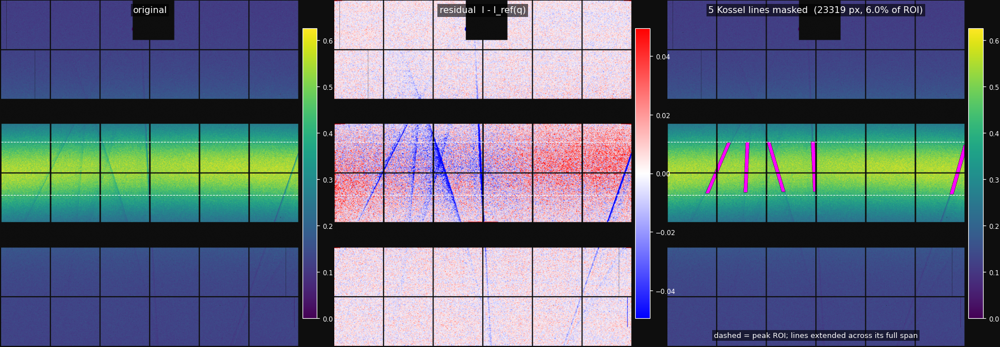

# Proposal: automatic artifact masking in pySimpleMask

**For:** Miaoqi Chu · **From:** Q. Zhang · **Date:** 2026-09-17

Diamond-anvil-cell patterns at 8-ID-E carry narrow dark streaks crossing the
scattering — neither detected nor masked automatically today. Reference frame:

```
/gdata/dm/8ID/8IDE/2026-3/pope202609/data/G0256_HEA-Dec9GPa_a0001_f003000_lambda2M_r00001/
```

Lambda2M, where the q map is trustworthy. Below: a method that finds them, and
what it recovers on that frame.

---

## 1. What they are

**Kossel lines from the diamond anvil.** Diffuse scattering from the sample acts
as a divergent source illuminating the downstream anvil, a large single crystal.
Directions meeting a Bragg condition get diffracted out of the transmitted cone,
leaving a narrow dark line where intensity is *missing*.

Two properties matter for the software:

- **They are dark, not bright** — subtractive. Every line found in this study was
  dark.
- **They are fixed in the lab frame, by the cell orientation**, not in detector
  pixels. They move drastically when the cell is rotated and barely at all when
  the sample is translated (operator experience). The confirmed case in §3 backs
  this from the data: the same pixels show a −23% line at one detector angle and
  nothing 4° away.

The bright spots are the complementary case: an anvil or coarse-grain reflection
landing *on* the detector.

The practical consequence: an artifact mask is valid for one cell orientation,
and stays valid across a translation mesh.

---

## 2. Proposed algorithm

Work in the **q-φ frame from pysimplemask itself**, never in a hand-rolled one.
`compute_transmission_qmap()` returns per-pixel `q`, `TTH` and `phi`; the swing
angles come from `flightpath_swing` (horizontal) and `flightpath_swing_vertical`
(vertical), and the beam centre is the direct-beam pixel at **zero swing on both**.
For the reference frame here that gives q ∈ 3.111–3.455 Å⁻¹ and φ ∈ 87.19–92.82°.

Two facts make the rest easy, and both come straight out of those maps:

```
dq/drow = -1.88e-4 A-1/px     dq/dcol = 0
dphi/dcol = -0.00344 deg/px   dphi/drow = 0
```

**q depends only on row, φ only on column.** A narrow q bin is therefore a band of
rows, and I-vs-φ within it is simply the intensity profile across columns.

### The method

```
0. apply the standard blemish FIRST   lambda2m_qmap_default.hdf  (see note below)
1. restrict to the peak    only pixels in the analysis ROI matter, and the high
                           intensity there is what makes a fractional dip visible
2. narrow q bins           ~4 rows (~0.00075 A-1)
3. I versus phi per bin    powder scattering is flat in phi; a Kossel line is a
                           localised DIP at one phi
4. find the discontinuity  running median over phi as baseline; flag phi where I
                           falls > 2.5 robust sigma below it
5. LINK across q bins      the dip drifts smoothly in phi. Track bin-to-bin,
                           predicting the next phi from the slope so far
6. EXTEND the full ROI     fit phi(q) linearly and extrapolate across the WHOLE
                           ROI - see below
7. VERIFY the extension    measure the dip depth on a narrow core along the
                           extrapolated part; keep it only if still dark
8. rasterise WIDE          paint the measured width plus ~7 px each side
```

**Use the standard blemish, not the raw TIFF.** `lambda2m_qmap_default.hdf`
carries a `mask` that removes **43,861 more pixels** than
`latest_blemish.tif` and is a strict superset of it. Applying it first removes
dead regions and hot pixels before any Kossel logic runs, and it eliminates a
whole class of false detections.

**Extend every line across the full ROI (steps 6-7).** Kossel lines are set by
the anvil and do not stop mid-peak. A track that ends early means *detection*
faded, not the line. So fit and extrapolate, then verify the extrapolated part
really is dark before keeping it. Decide on a **narrow core** (±3 px, where the
contrast is undiluted) but **mask wide** (±7 px beyond the measured width) — the
two must not use the same width or the accept/reject test loses sensitivity.

**Masking generously is nearly free.** XPCS SNR scales as √N_pixels, and these
lines are narrow. Masking 6.0% of the ROI costs **3.05%** in SNR — far less than
leaving a −27% intensity deficit inside the correlation.

**Step 4 is what makes it work.** Kossel lines are conic sections, so they are
curved and run at arbitrary angles. Tracking follows that curvature; anything that
assumes a fixed orientation does not.

### Four things that break it

**(a) Do not collapse a profile over the whole detector.** A column profile
averaged over all rows smears a drifting dip into nothing and returns a confident
null. The dip must be found *per narrow q bin*, then linked.

**(b) Do not use a straight-line matched filter.** A prototype scanned straight
kernels at 10° steps. Because the lines are curved a straight kernel only matches
short chords, so it fragmented long lines and missed shallow ones entirely: 7
fragments where there are 5 continuous streaks, and two never found at all.

**(c) A track that reaches the end of its detected span is not finished.** Four
of the five streaks here were detected over only part of the ROI and had to be
extrapolated to full length. Verify the extension rather than trusting it: two
further candidates were rejected outright because their core depth came out
*positive* (+2.7%, +4.2%) — they were never dark lines.

**(d) Dead pixels and Kossel lines look identical to a threshold.** A dead pixel
reads *exactly zero*; a Kossel line is a fractional dip. Split on depth ratio —
this also guards against a stale blemish map, since unflagged dead pixels are
otherwise the detector's first find.

## 3. Result on real data

`G0256_HEA-Dec9GPa_a0001_f003000_lambda2M_r00001`, δ = 24.48°, 300-frame average.
Standard blemish applied first; ROI q = 3.2632–3.3126 Å⁻¹ (rows 740–1019,
388,419 live px). 658 raw dips over 69 q bins → 30 tracks → **5 streaks**:

| # | bins | detected rows | cols across ROI | angle | core depth | extension depth |
|---|---|---|---|---|---|---|
| 1 | 114 | 750–1010 | 324 → 205 | +113.1° | −5.1% | −4.4% |
| 2 | 14 | 746–1006 | 418 → 408 | +92.2° | −5.3% | −3.8% |
| 3 | 83 | 746–1002 | 529 → 612 | +73.4° | −13.1% | −11.8% |
| 4 | 82 | 742–1002 | 761 → 773 | +87.5° | −27.5% | −21.5% |
| 5 | 68 | 774–1014 | 1566 → 1487 | +105.8° | −13.6% | −5.8% |

All five extended across the full ROI, each extension confirmed dark.
Two further candidates rejected (core depth +2.7%, +4.2%).

**23,319 px = 6.00% of the ROI; XPCS SNR cost 3.05%.**



*Full detector; dashed lines mark the peak ROI. Left: original. Middle: residual
against I_ref(q). Right: masked pixels in magenta, extended across the full ROI
span. Dark bands are module gaps and dead chip columns.*

Five angles from +73° to +113° is itself proof these are not detector structure —
nothing in the hardware is slanted, let alone slanted five different ways.

**Thresholds are meant to be tuned.** These come from `--artifact-nsig 2.5` with a
6-bin minimum. More aggressive settings will find more; the core-depth test is
what keeps false positives out as the threshold drops, so lower the threshold and
let the verification stage do the rejecting.

## 4. Suggested interface

Three mask layers with different lifetimes, kept separate:

| layer | lifetime | source |
|---|---|---|
| blemish | permanent, per detector | site TIFF (maintained by the beamline) |
| **artifact** | per cell orientation | proposed auto-detection |
| user | per analysis | manual ROI |

A minimal CLI surface consistent with the existing `build` options:

```
--auto-artifact {off,streaks}     default off
--artifact-qrange QLO:QHI         restrict to the ROI that matters; the high
                                  intensity inside a peak is what makes a
                                  fractional dip detectable
--artifact-qbin N                 rows per narrow q bin (default ~4)
--artifact-nsig N                 dip threshold in robust sigma (default ~2.5)
--artifact-extend {off,verified}  extrapolate tracks across the ROI and keep
                                  only extensions that measure dark (default verified)
--artifact-pad N                  extra px each side of the measured width (default ~7)
--artifact-min-bins N             q bins a track must span to be kept (default ~5)
--artifact-dead-frac F            depth/ref beyond this = dead pixel, routed to
                                  the blemish layer (default 0.9)
--artifact-from FILE [FILE ...]   build from a high-statistics sum, apply to target
--output-artifact-mask FILE       write the layer separately
```

Two points of principle:

- **Report, never silently mask.** Print counts and total area removed, and write
  the layer as its own file. A mask that quietly deletes 5% of a detector is worse
  than the artifact when it is wrong.
- **Default off**, until it has a track record.

---

## 5. Suggested order

1. Add the per-pixel q/φ accessor if one is not already public —
   `compute_transmission_qmap()` already returns everything needed.
2. Implement narrow-q-bin dip detection with φ linking. **Validate against G0256**
   (§3): known answer, trustworthy geometry, five streaks from −27% to −41%.
3. Expose `--artifact-nsig` and a q-range restriction, and report detections
   rather than applying them silently.
4. Spot detection last — compact bright features are easier, and
   `--threshold-high` already covers part of it.

---

## Appendix — reproduction

Prototype scripts, on `amber`, all under
`/home/beams10/8IDIUSER/xpcs_contrast_check/`:

| file | does |
|---|---|
| `phi_v5.py` | the detector: blemish, dip finding, linking, extension, verification |
| `fig_v5.py` | writes the figure above |
| `hunt_kossel.py` | earlier full-detector search (superseded) |
| `sum_list.py` | high-statistics sum over a scan |
| `psm_maps.npy` | per-pixel q / TTH / phi from pysimplemask |
| `std_mask.npy` | standard blemish from lambda2m_qmap_default.hdf |

Products, same directory:

| file | contents |
|---|---|
| `kossel_v5.png` | the figure above |
| `k2_img.npy` | 300-frame average of G0256 (1813×1558) |
| `phi_mask_v5.npy` | the five extended streaks, bool (23319 px) |
| `phi_dips.npy` | raw per-bin dips before linking |
| `k2_good2.npy` | valid-pixel mask, blemish applied |

Data referenced:

```
/gdata/dm/8ID/8IDE/2026-3/pope202609/data/G0256_HEA-Dec9GPa_a0001_f003000_lambda2M_r00001/
/gdata/dm/8ID/8IDE/2026-3/pope202609/data/G025{3,4,5}_HEA-Dec9GPa_*_f003000_lambda2M_r00001/
/home/beams/8IDIUSER/Documents/areaDetectorBlemish/8idLambda2m/latest_blemish.tif
```

All read-only with respect to the beamline: file reads and compute only.
