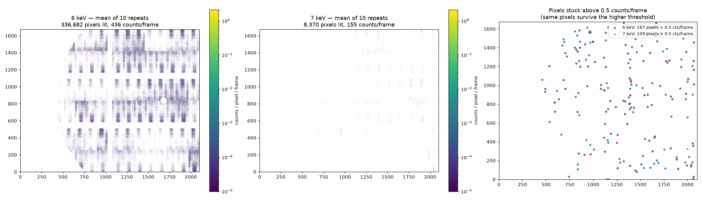

# Rigaku 3M dark noise at 6 and 7 keV

Measured 2026-09-08, **no beam**. Twenty measurements (two thresholds × ten
repeats × 10 000 frames at 20 µs), correlated with `boost_corr` Multitau on
`adamite`. Everything below comes from `xpcs/temporal_mean/scattering_2d` —
the time-averaged counts per pixel per frame.

## Headline

**188 pixels — 0.0082 % of the detector — produce most of the dark counts, and
raising the discriminator does not remove them.**

| | 6 keV | 7 keV |
|---|---|---|
| total counts / frame | 435.7 | 154.7 |
| pixels with any count | 336 682 | 8 370 |
| pixels above 0.5 counts/frame | 187 | 109 |
| counts / frame from those pixels | 265.2 | 153.6 |
| **their share of all counts** | **60.9 %** | **99.3 %** |
| hottest pixel | 106 022 counts/s | 97 477 counts/s |

Going from 6 to 7 keV removes **98 %** of the pixels that see anything at all
(336 682 → 8 370) but only **42 %** of the hot ones (187 → 109), and **108 of
the 109** that survive were already hot at 6 keV. So the threshold is doing its
job on the diffuse noise floor and doing almost nothing to this small
population — which is why the hot pixels' share of the total *rises* from 61 %
to 99 % as the threshold goes up.

At 7 keV, in other words, essentially everything the detector reports is these
pixels.

## Two populations

Splitting the 188 by how much of their rate survives the 6 → 7 keV step:

| | count | median rate at 7 keV |
|---|---|---|
| **threshold-immune** (keeps > 50 % of its 6 keV rate) | **100** | 69 801 counts/s |
| threshold-responsive | 88 | 6 842 counts/s |

The 100 immune pixels alone carry **135.9 of the 154.7 counts/frame at 7 keV
(87.9 %)**.

That split is the useful one. A pixel seeing real low-energy noise loses most of
its rate when the discriminator moves up; these 100 do not, so they are not
responding to the radiation environment at all. Individual pixel examples, from
the census:

```
row   col    6 keV cts/s   7 keV cts/s
1360  831        100,146        88,594   <- immune
 855  635        106,021        68,191   <- immune
 931  486         99,346         5,269   <- responsive
 319 1005         93,589         4,594   <- responsive
```

They are **not** stuck at an exact integer count — only 1 of 188 sits within
0.01 of a whole number after averaging 100 000 frames — so this is a high,
variable rate rather than a frozen counter value.

Spatially they are scattered across the whole detector, not clustered at module
edges or in one ASIC, which points at individual bad pixels rather than a
readout-geometry artefact.

## The 6 keV noise is structured



Left and centre share a colour scale. At 6 keV the diffuse floor is not random:
it follows a regular block pattern across each module, which is the chip/column
structure of the detector. At 7 keV that structure is essentially gone. The
right panel plots only the pixels above 0.5 counts/frame — blue (6 keV) and red
(7 keV) sit on top of each other, which is the 108-of-109 overlap in visual
form.

## Reproducibility

6 keV was measured twice, in two separate sessions about an hour apart
(`A0163`, and `A0171` as part of the timing re-check):

| | repeats analysed | counts/frame | hot pixels | hot share |
|---|---|---|---|---|
| `A0163` | 10 | 435.7 | 187 | 60.9 % |
| `A0171` | 10 | 436.3 | 187 | 60.8 % |

The same 187 pixels, the same hot share, and total rates agreeing to 0.14 %
(435.7 vs 436.3), from two independent sessions an hour apart. The number of
lit pixels also matches to 0.05 % (336 682 vs 336 501). This is a stable
property of the detector, not a transient.

## What to do with this

* **The 100 threshold-immune pixels belong in the blemish mask.** They are not
  currently masked — they are present in `scattering_2d` after the qmap mask has
  been applied. At 7 keV they are 88 % of the signal, so any q-bin containing one
  is dominated by it.
* **The full census is checked in as
  [`rigaku3m-hot-pixels.csv`](rigaku3m-hot-pixels.csv)** — row, column, and the
  rate at each threshold for all 188, sorted by 6 keV rate. That is the list to
  hand to the vendor or to feed into a mask. (Working copy on `adamite`:
  `/home/beams/8IDIUSER/thr_analysis/`.)
* **Raising the threshold is not a fix for these.** It is very effective against
  the diffuse floor (40× fewer lit pixels) and nearly useless against the hot
  population.

## Caveats

* **No beam.** These are dark rates. They set a floor; they do not tell you the
  signal-to-noise of a real measurement.
* **0.5 counts/frame is an arbitrary cut** for "hot", chosen because it is three
  to four orders of magnitude above the typical pixel (≈ 2 × 10⁻⁴ at 6 keV). The
  population is well separated, so the exact cut barely matters — moving it from
  0.1 to 0.9 changes the 6 keV count from 279 to 167.
* Only the ZDT (`.bin`) datasets could be analysed. The Fast Transfer `.h5.NNN`
  output cannot be read by `boost_corr` at all — see
  [ZDT vs Fast Transfer](rigaku-zdt-vs-fast-transfer.md#what-you-can-do-with-the-data-afterwards).

## Reproducing

```bash
BC=/home/beams/8IDIUSER/.conda/envs/xpcs_analysis_312/bin/boost_corr
B=/gdata/dm/8ID/8IDE/2026-3/comm202609/data
$BC -r $B/A0163_Thr6keV_a0002_f010000_r00001/A0163_Thr6keV_a0002_f010000_r00001.bin.000 \
    -q $B/rigaku3m_qmap_default.hdf -o <outdir> -t Multitau -i -1
```

`xpcs_analysis_312` is the only `boost_corr` environment on `adamite` that
currently works; several others raise `PackageNotFoundError` for `boost-corr`.
Note each run spawns ~180 threads and takes ~20 cores, so keep the parallelism
low on a shared box.

Which measurement is which threshold:
[ZDT vs Fast Transfer → Which files are which threshold](rigaku-zdt-vs-fast-transfer.md#which-files-are-which-threshold).
